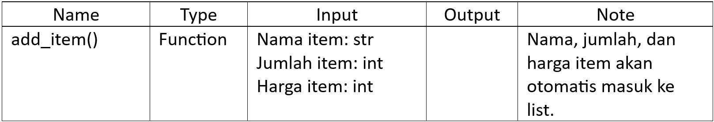
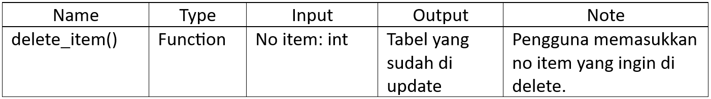
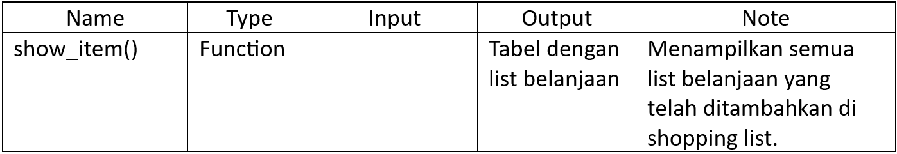
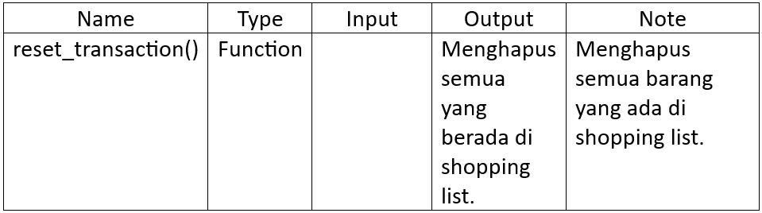
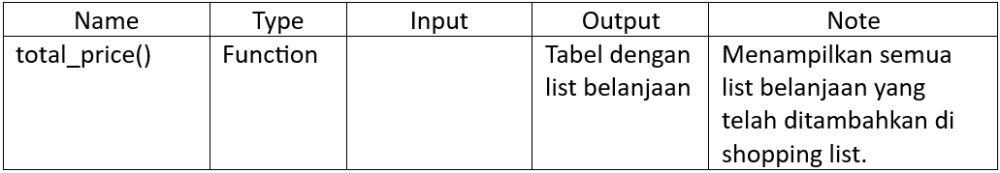
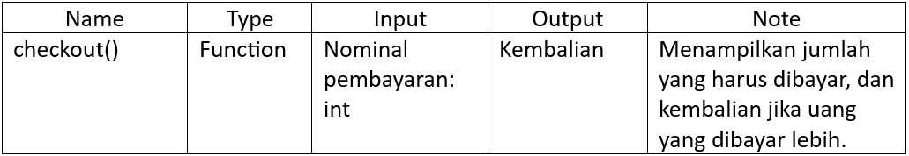

# Project-Python-Pacmann

## A.	Problem
Dhio, seorang pemilik supermarket terkemuka di salah satu kota di Indonesia, memiliki rencana untuk meningkatkan proses bisnisnya dengan mengembangkan sebuah sistem self-service di supermarketnya. Melalui sistem ini, para pelanggan dapat secara langsung memasukkan informasi mengenai barang belanjaan, jumlah barang, serta harga barang yang mereka beli, beserta berbagai fitur lainnya. Dengan adanya sistem ini, Dhio berharap agar pelanggan yang berada di luar kota pun dapat melakukan pembelian barang dari supermarketnya.

Namun, Dhio mengalami kendala dalam merealisasikan rencananya tersebut, yakni kebutuhan akan seorang programmer yang mampu menciptakan fitur-fitur yang diperlukan agar sistem self-service di supermarketnya dapat berjalan dengan lancar.

## B.	Flowchart and Requirement
### 1.	Flowchart

  

### 2.	Requirement
Terdapat 8 function di program ini, yaitu:
#### 1)	add_item()
Tujuan: input dan menambahkan barang ke list shopping_list

  

#### 2)	update_item/qty/price()
Tujuan: merubah nama/jumlah/harga barang

  

#### 3)	delete_item()
Tujuan: menghapus list belanjaan yang dipilih.

  

#### 4)	show_item()
Tujuan: menampilkan list shopping_list dengan format tabel menggunakan

  

#### 5)	reset_transaction()
Tujuan: menghapus atau reset semua list di shopping_list

  

#### 6)	total_price()
Tujuan: Menghitung total harga list belanja, menghitung diskon yang didapatkan berdasarkan harga yang dibelanjakan, dan menghitung total harga setelah diskon.

  

#### 7)	checkout()
Tujuan: menampilkan total harga belanja setelah diskon dan tempat untuk melakukan
Pembayaran.

  

## C.	Test Case
Run file main.py dan akan langsung memerintahkan untuk menginput nama user, setelah itu akan langsung memerintahkan untuk menginput nama barang.
### 1.	Test Case 1
  #### a.	Instruction: Menambahkan dua item baru menggunakan metode add_item(). Item yang ditambahkan adalah sebagai berikut:
1)	Nama item: ayam goreng, qty: 2, harga: 20000
2)	Nama item: pasta gigi, qty 3, harga: 15000
  #### b.	Steps: setelah menginput nama, langsung menambahkan nama, quantity, dan juga harga sesuai dengan test case, setelah input maka akan tersimpan ke dalam list.
  #### c.	Result:

  

### 2.	Test Case 2
  #### a.	Instruction: Menggunakan metode delete_item() untuk menghapus item. Item yang ingin dihapuskan adalah pasta gigi.
  #### b.	Steps: ke menu utama lalu memilih no 3 yaitu “Hapus Barang”, setelah itu pada pilihan hapus item pilih no 1 yaitu “Hapus item”, lalu pilih no item yang ingin dihapus, dalam case ini item no 2 yaitu pasta gigi, maka masukkan angka 2 dan item telah terhapus.
  #### c.	Result: 

  

### 3.	Test Case 3
  #### a.	Instruction: Menggunakan metode reset_transaction untuk menghapus semua item.
  #### b.	Steps: Kembali ke menu utama, lalu pilih no 5 yaitu “Reset barang”, lalu ketik “y” pada pilihan “Apakah anda yakin menghapus list belanjaan anda? (y/n)”, maka semua item akan terhapus
  #### c.	Result: 

  

### 4.	Test Case 4
  #### a.	Instruction: Menghitung total belanjaan menggunakan metode total_price(). Sebelum mengeluarkan output total belanja akan menampilkan item yang dibeli
  #### b.	Steps: kembali ke menu utama, lalu pilih no 6 yaitu “Total harga”, lalu akan menampilkan list barang yang sudah ditambahkan sebelumnya, total harga per barang, total keseluruhan harga barang, dan diskon yang didapat.
  #### c.	Result:

  

## D.	Conclusion
Self service cashier adalah program yang memungkinkan pengunjung supermarket untuk menambah barang, merubah barang (nama, qty, harga), menghapus barang, menampilkan barang, mereset list belanjaan, menampilkan total harga, sampai ke pembayaran.

## E.	Future Works
Menggunakan user interface yang lebih menarik, dan dapat menyimpan history belanja dari tiap pengunjung supermarket.

